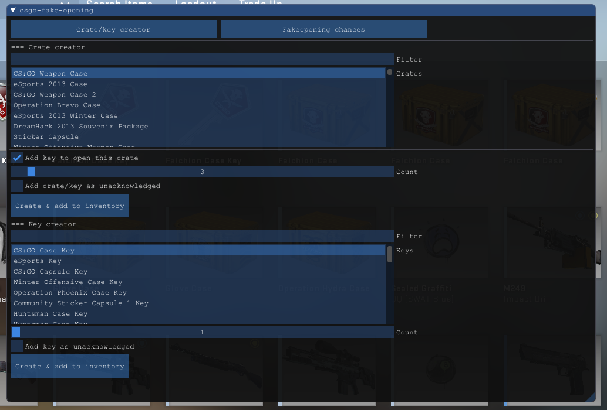
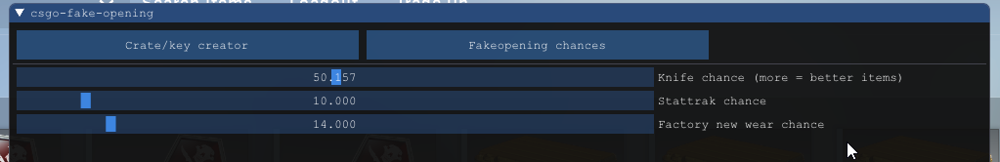

# Showcase

# csgo-fake-opening
csgo-fake-opening allows to open unlimited crates/capsules, everything is localside so will not have that items in your inventory.

- Open any crate/capsule you want
- Support for tournaments crates
- Configure your chance to get items
- In-game configuration with <a href="https://github.com/ocornut/imgui">ImGui</a>

# Usage
- Clone the source with: git clone --recursive https://github.com/B3akers/csgo-fake-opening.git
- Compile using your preferred compiler
- Inject the resulting library into the game
- Press <kbd>Insert</kbd> to bring up the menu.
- Create crate/keys you want to open
- OPEN!

# License
<b>This project is licensed under the MIT license</b>

See the "<a href="https://github.com/b3akers/csgo-fake-opening/blob/master/LICENSE">LICENSE</a>" file for more details.
